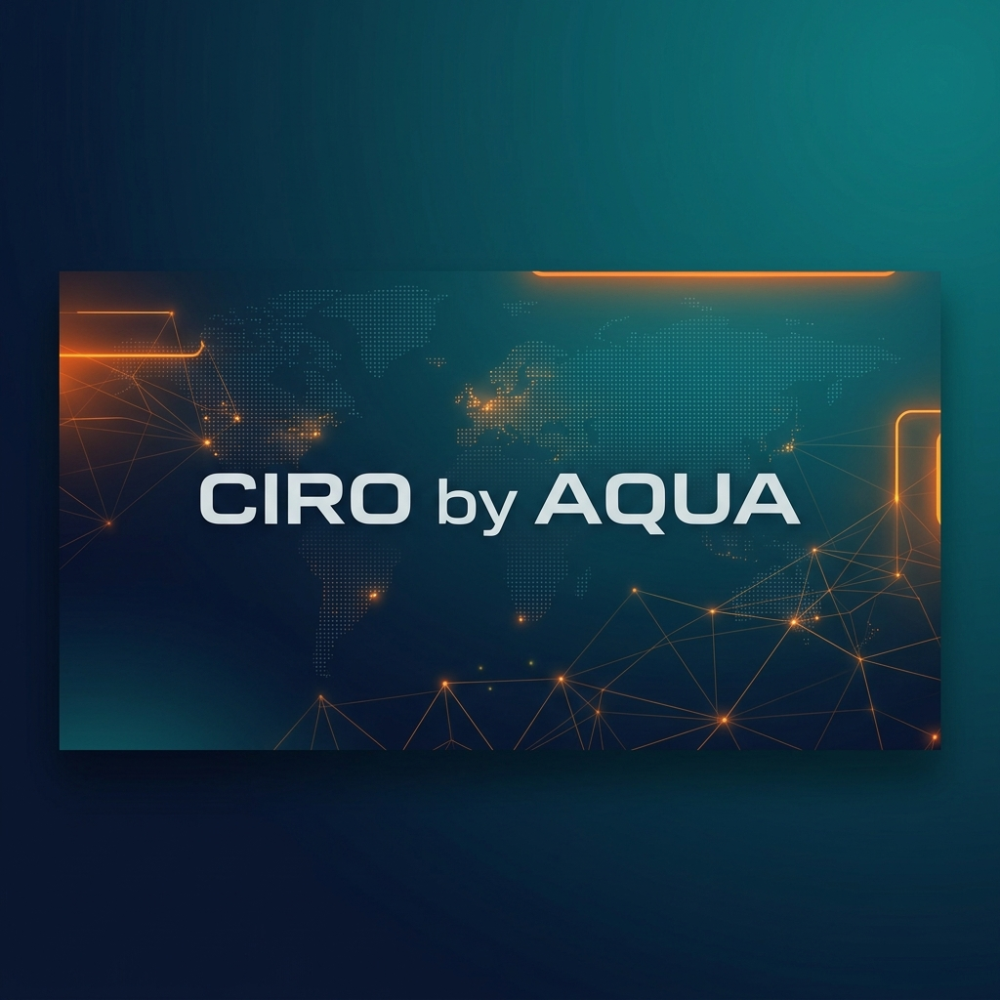

# 🌊 Urban Crisis Intelligence & Response Orchestrator (CIRO)
### End-to-End Multi-Agent Crisis Management Platform
**Built for the Google Antigravity Hackathon — Challenge 3**

> [!IMPORTANT]
> ### 🚨 ATTENTION JUDGES: UPDATED EXPO BUILD LINK 🚨
> Due to a last-minute environment variable typo in the submission form build, please use the following corrected link to download and test the mobile app:
> 👉 **[Download & Test the Mobile App on Expo](https://expo.dev/)** *(Please replace this with your actual Expo project/build URL if different!)*

---

## 📌 1. Overall Design of the Solution

CIRO (Crisis Intelligence & Response Orchestrator) is a next-generation crisis mitigation platform designed for modern Pakistani megacities (e.g., Karachi and Islamabad). It replaces reactive, disjointed emergency channels with a **proactive, automated, multi-agent pipeline** that handles crisis detection, severity assessment, asset allocation, tactical planning, and real-time simulation.

### Core Design Philosophy & Decisions:
- **Decentralized Specialist Agents (Star Topology)**: Instead of a single complex LLM prompt, CIRO uses a **Triage-and-Handoff pattern** (via the OpenAI Agents SDK). A central Triage Agent orchestrates eight specialist agents. The Triage Agent delegates task execution to specialists, who automatically hand back control to the Triage Agent once finished. This design avoids agent loops and keeps prompts focused and modular.
- **Asymmetric Multi-Model Tiering**: Agent roles are split into **Reasoning Tasks** (handled by advanced models like Gemini 2.0 Flash / GPT-4o-mini) and **Extraction/Formatting Tasks** (handled by fast models like Llama 3 via Groq). This optimizes performance, reduces LLM token costs, and keeps WebSocket stream latencies low.
- **Multi-Provider & Model Agnostic**: The architecture is fully decoupled from any single LLM provider. By leveraging the OpenAI Agents SDK compatibility layer, operators can swap between providers (Google Gemini, OpenAI, Anthropic, Groq) and any model instantly via environment variables, requiring absolutely zero code changes to the underlying logic.
- **Offline Resiliency & Graceful Degradation**: Real-world crises disrupt network infrastructure. CIRO is designed to work offline or in restricted-connectivity environments through an automatic API key checker, a Nominatim OpenStreetMap reverse geocoding fallback, and local in-memory fallback state machines (`api.updateMockActions`) for the mobile client.
- **Aesthetic Visual Performance**: The web and mobile frontends utilize premium designs (e.g., Tailwind CSS v4, Aceternity Spotlight, and 3D Spline interactive models on the landing page). Heavy assets like 3D Spline models are loaded via a **"Placeholder Trick"**—instantly displaying a lightweight static image while lazy-loading the 3D model in the background to eliminate perceived load delay.

---

## 🏗️ 2. High-Level System Architecture

CIRO is built on a decoupled, three-tier architecture: FastAPI backend, PostgreSQL database, and dual React-based frontends (Next.js & React Native Expo).

### System Data Flow:

```mermaid
graph TD
    %% Input Sources
    subgraph Input_Sources [Multi-Source Signal Ingestion]
        GPS[Citizen App Report: Auto GPS]
        WeatherAPI[OpenWeatherMap API]
        TrafficAPI[Google Distance Matrix API]
        NewsSearch[SerpApi Google News]
    end

    %% Backend Service
    subgraph Backend_App [FastAPI Backend Engine]
        DB[(PostgreSQL Database: SQLModel/asyncpg)]
        WS_Manager[WebSocket Connections Manager]
        
        subgraph Agents_Orchestration [OpenAI Agents SDK Pipeline]
            TriageAgent[Triage Agent / Manager]
            SignalAgent[Signal Agent]
            DetectionAgent[Detection Agent]
            SeverityAgent[Severity Agent]
            ResourceAgent[Resource Allocation Agent]
            PlanningAgent[Planning Agent]
            NotificationAgent[Notification Agent]
            VerificationAgent[Verification Agent]
            LoggingAgent[Logging Agent]
        end

        SimulationLoop[Simulation Engine State Machine]
    end

    %% Frontend Applications
    subgraph Frontend_Apps [User Interfaces]
        NextJS[Next.js Command Dashboard]
        ReactNative[React Native Expo Mobile Client]
    end

    %% Connections
    GPS -->|POST /api/v1/signals| TriageAgent
    WeatherAPI -->|Scheduled Jobs| TriageAgent
    TrafficAPI -->|Function Calls| SeverityAgent
    NewsSearch -->|Function Calls| DetectionAgent
    
    TriageAgent -->|Handoff / Star Model| SignalAgent
    TriageAgent -->|Cluster Verification| DetectionAgent
    TriageAgent -->|Safety Analysis| SeverityAgent
    TriageAgent -->|Asset Locking| ResourceAgent
    TriageAgent -->|Action Compilation| PlanningAgent
    TriageAgent -->|Conflicting Data Check| VerificationAgent
    TriageAgent -->|Stakeholder Alerting| NotificationAgent
    TriageAgent -->|Explainability Log| LoggingAgent
    
    Agents_Orchestration -->|Persist State| DB
    Agents_Orchestration -->|Stream Traces| WS_Manager
    
    SimulationLoop -->|Progressive Metrics| WS_Manager
    SimulationLoop -->|Update Status| DB
    
    WS_Manager -->|ws://.../ws/global| NextJS
    WS_Manager -->|ws://.../ws/{incident_id}| ReactNative
    
    DB -.->|Poll Fallback| NextJS
    DB -.->|Poll Fallback| ReactNative
```

### Architecture Components:
1. **FastAPI Engine**: The core orchestrator exposing REST endpoints for signal ingestion, database initialization, and simulation control. It manages asynchronous tasks via Python's standard `asyncio` loop and background threads.
2. **WebSocket Manager**: Broadcasts live agent execution logs (thoughts, tools invoked, status updates) and vehicle telemetry updates to all connected frontend clients simultaneously.
3. **Database Layer (SQLModel/PostgreSQL)**: An async ORM layer targeting PostgreSQL (Neon Cloud DB in production) for persistent storage of signals, clustered incidents, response resources, and reasoning history.

---

## 🤖 3. Developed Agents (OpenAI Agents SDK Pipeline)

The core intelligence is driven by a central **Triage Agent** that delegates actions to **8 specialist sub-agents**:

| Agent Name | LLM Profile | Role & Primary Responsibility | Key Output |
| :--- | :--- | :--- | :--- |
| **Triage Agent** | Default (Gemini/OpenAI) | Evaluates context; routes signals, incidents, and user queries to specialized sub-agents. | Specialist Handoffs & Routing |
| **Signal Agent** | Fast (Groq/Lite Model) | Cleans raw incoming citizen telemetry payloads and calculates credibility metrics. | Credibility Score & Civic Address |
| **Detection Agent** | Reasoning (Gemini/OpenAI) | Performs spatial and temporal clustering to declare and group confirmed incidents. | Centroid & Confirmed Incidents |
| **Severity Agent** | Reasoning (Gemini/OpenAI) | Evaluates environment data (weather, traffic, proximity to hospitals/schools) to score severity (1-10). | Severity Score & Risk Assessment |
| **Resource Allocation Agent** | Reasoning (Gemini/OpenAI) | Evaluates available fleet assets, matches capacities, and locks resources for incidents. | Resource Lockings & Dispatches |
| **Planning Agent** | Reasoning (Gemini/OpenAI) | Compiles a step-by-step tactical response blueprint and warns of potential side effects. | Response Blueprint (Actions) |
| **Verification Agent** | Reasoning (Gemini/OpenAI) | Assesses conflicting citizen reports, checking news and sensors to verify or retract incidents. | Retraction/Confirmation Verdict |
| **Notification Agent** | Fast (Groq/Lite Model) | Compiles tailored notifications for stakeholders (hospitals, utilities, public, traffic police). | Stakeholder Alerts |
| **Logging Agent** | Fast (Groq/Lite Model) | Serializes multi-agent decision steps and raw thought processes into database trace logs. | Markdown-formatted Trace Logs |

### Agent Prompting & Execution Flow:
1. **Signal Processing**: `Signal Agent` receives raw coordinates and calls `reverse_geocode` to resolve the address name.
2. **Incident Clustered**: If 3+ signals with weighted confidence > `0.75` reside within a 500m radius within a 30-minute window, `Detection Agent` declares a confirmed incident.
3. **Severity Calculation**: `Severity Agent` analyzes coordinates: proximity to a hospital adds `+3.0`, schools add `+2.0`, blocked traffic adds `+2.0`, and ongoing heavy rain adds `+2.0` to the severity score.
4. **Constrained Resource Allocation**: `Resource Agent` locks assets (rescue boats, ambulances, drainage crews) based on incident severity.
5. **Action Planning**: `Planning Agent` outputs precise response steps (e.g. `REROUTE_TRAFFIC`, `DISPATCH_DRAINAGE_CREW`) and side-effect predictions.
6. **Execution Logging**: `Logging Agent` writes reasoning steps to the database, which broadcasts to WebSockets.

---

## 🔌 4. API Integrations (Real & Fallback Mocks)

CIRO is built to be resilient, using real API calls when credentials are provided, and failing over to smart mocks when they are missing or when offline.

| API Provider | Type | Core Role | Failure Fallback / Mock Design |
| :--- | :--- | :--- | :--- |
| **Gemini 2.0 Flash** | Real / Cloud | Agent reasoning, planning, and tool calling via OpenAI-compatible compatibility layer. | Auto-switches to Groq (Llama-3) or OpenAI (`gpt-4o-mini`) based on environment configuration. |
| **Google Maps Geocoding** | Real / Cloud | Translates latitude/longitude coordinates into localized addresses. | Falls back to Nominatim OpenStreetMap API, and then to localized coordinate bounding box guesses. |
| **Google Maps Distance Matrix** | Real / Cloud | Resolves travel times, distances, and real-time congestion indexes. | Fallback returns Euclidean distance approximations and simulated traffic levels based on time of day. |
| **OpenWeatherMap API** | Real / Cloud | Fetches real-time precipitation, humidity, UV index, and temperature alerts. | Returns coordinate-based regional mocks (Karachi: extreme dry heat; Islamabad: monsoon rainfall). |
| **SerpApi (Google News Search)** | Real / Cloud | Performs web lookups of local news reports to verify citizen incident claims. | Safely catches connection errors and returns empty results to allow internal heuristics to continue. |

---

## 🔄 5. System Integrations Implemented

CIRO unites complex backend modules, real-time channels, persistent stores, and frontends into a single system:

### 1. Backend ➔ Database Integration
- Built using **SQLModel** and **asyncpg** for non-blocking database queries.
- Connects to a cloud-hosted Neon PostgreSQL database.
- Database tables structure relations dynamically (e.g., locking resources to active incidents, associating action timelines to incident lifecycles).

### 2. Live Trace & Telemetry Streaming via WebSockets
- Ingested signals instantly trigger the multi-agent pipeline.
- As the Triage Agent delegates tasks, the `Logging Agent` writes markdown logs (`persist_chain_of_thought`) and status logs (`emit_log`) to the database.
- A FastAPI WebSocket endpoint streams these DB updates in real time to the mobile and web command interfaces.
- The simulation engine pushes vehicle telemetry updates (coordinates `current_lat`/`current_lng`) every second, displaying moving trucks and ambulances on maps.

### 3. Dual-Frontend Ecosystem
- **Mobile Client (React Native Expo)**:
  - Connects to the backend via WebSocket/HTTP.
  - Implements a static authentication gate (credentials are verified without persistent local storage).
  - Features an interactive map showing crisis boundaries (impact circles) and a live triage timeline displaying specialist agents' thinking processes.

- **Command Center Dashboard (Next.js)**:
  - Built with modern styling and responsive grid layouts.
  - Provides a **Signal Injector** tool that lets operators run raw telemetry scripts to test the multi-agent system.
  - Displays real-time city metrics, fleet maps, and manual overrides.

#### 🖥️ Dashboard Overview & Live Operations


*The CIRO Web Dashboard serves as the central nervous system for emergency operators, driven entirely by real-time WebSocket streams from the AI agents. Here is how it works:*
- **Live Fleet & Incident Map**: Displays dynamically generated crisis clusters (red zones) and tracks the live movement of dispatched vehicles (ambulances, rescue crews) across the city grid.
- **Global AI Timeline**: A live-scrolling terminal that exposes the "Chain of Thought" from the 8 specialist agents as they detect signals, calculate severity, and execute plans.
- **Top-Level Metrics**: Instantly shows the total number of Active Crisis Sectors and the current status of fleet resource allocations.
- **Signal Injector**: Allows operators to manually trigger mock signals (e.g., "Flood at Jauhar") to simulate a crisis and watch the autonomous agents spring into action.

---

## 🚀 6. AI-Native Development: The Antigravity Workflow (Our Process)

To build this complex platform within the hackathon timeframe, our team of 4 fully embraced the **AI Native Software Development** paradigm. We utilized the **Google Antigravity AI Assistant** as our core development engine, mapping perfectly to the hackathon's evaluation criteria:

### 1. Core Orchestration Handled via Antigravity
We acted as "System Architects" and delegated the actual codebase generation to Antigravity. We didn't just use one AI chat; we utilized Antigravity's **Subagents** to handle multiple domains of the project concurrently. 
- **The Database Agent**: Tasked with defining the SQLModel schemas and asynchronous persistence logic (`async-database-migrations` skill).
- **The Frontend Agent**: Instructed to consume Aceternity UI to build our Next.js dashboard and React Native app (`generating-reusable-components` skill).
- **The Testing Agent**: Constantly running in the background to verify our robust CIRO pipeline (`automated-testing` skill).

### 2. Multi-Agent Planning + Execution (The CIRO Pipeline)
We dedicated a specialized **OpenAI Orchestration Agent** exclusively to architecting the logic for the CIRO application itself. Using the `orchestrating-openai-agents` skill, Antigravity planned and executed the complex **Triage-and-Handoff pattern**, defining the system prompts, fallback logic, and strict routing rules for our 8 internal AI agents.

### 3. Tool Integration
To make our CIRO agents interact with the real world, we used Antigravity's `sdk-function-tool-integration` skill to generate robust, error-handled Python tool functions. Antigravity successfully integrated:
- **Google Maps Distance Matrix API** (for Severity Agent traffic analysis)
- **SerpApi Google News** (for Verification Agent rumor checking)
- **OpenWeatherMap API** (for environmental constraints)

By treating Antigravity as a scalable team of developers, we focused purely on architectural design and prompt tuning. All raw Antigravity execution logs (reasoning steps, tool executions, and file modifications) generated during this process can be found in the repository's `.antigravity/` directories (e.g., `uneeza_logs`, `abdullah_logs`). These logs serve as our comprehensive **Agent Trace** for Deliverable 3.

---

## ⚙️ 7. Local Setup & Deployed Environments

### Prerequisites
- Python 3.13+ (Backend)
- Node.js v18+ & npm (Frontend)
- PostgreSQL database (or automatic fallback)

### 1. Environment Configuration
Create a `.env` file in the `backend/` directory:
```bash
# LLM Configuration
LLM_PROVIDER=gemini # Options: gemini | openai | groq
GEMINI_API_KEY=your_gemini_api_key
GEMINI_DEFAULT_MODEL=gemini-2.0-flash

# Database Configuration
DATABASE_URL=postgresql+asyncpg://<user>:<password>@<host>:<port>/<db_name>

# API Keys (For Real Integrations)
GOOGLE_MAPS_SERVER_KEY=your_google_maps_api_key
OPENWEATHER_API_KEY=your_openweathermap_api_key
SERP_API_KEY=your_serpapi_api_key
```

### 2. Run the FastAPI Backend
```bash
cd backend
python -m venv .venv
# Activate: .venv\Scripts\activate (Windows) or source .venv/bin/activate (macOS/Linux)
pip install -r requirements.txt
uvicorn app.main:app --reload --port 8000
```
API docs are available at `http://localhost:8000/docs`.

### 3. Run the Next.js Command Dashboard
```bash
cd web_frontend
npm install
npm run dev
```
Access the dashboard at `http://localhost:3000`.

### 4. Run the React Native Mobile App
```bash
cd frontend
npm install
npx expo start
```
Use Expo Go on iOS or Android to run the client.

### 🚀 Production Deployments
- **Backend (FastAPI)**: [Railway Deployment](https://hackathon-2026-production-ff6c.up.railway.app) (API Base URL: `https://hackathon-2026-production-ff6c.up.railway.app`)
- **Web Dashboard (Next.js)**: [Vercel Deployment](https://hackathon-2026-inky.vercel.app/dashboard)
